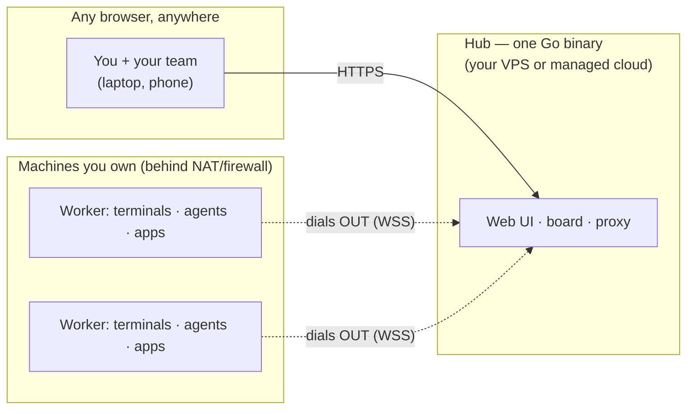

# Cordane

**Run your team's coding agents from anywhere — on machines you own.**

Cordane is a self-hostable control plane for AI coding agents (Claude Code and
friends) and the terminals, dev servers, and tickets around them. Workers run on
your hardware and dial **out** to the hub over a single outbound connection — so
you can reach a box behind corporate NAT or a home router from any browser, with
no inbound ports, no VPN, no SSH config.

🌐 **[cordane.ai](https://cordane.ai)** · 📖 **[Docs](https://cordane.ai/docs)** ·
🗺 **[Roadmap](https://cordane.ai/roadmap)** · 🔒 **Status: private beta —
[request access](https://cordane.ai/#beta)**



## What it does

**Persistent terminals, one browser tab away.** Real PTYs on your machines —
your login shell, your dotfiles, true color — that survive closing the laptop,
network drops, and hub restarts. Reattach from any browser, including your
phone (with a touch key bar for ctrl/esc/arrows). Two people can attach to the
same live terminal. If you live in tmux: sessions map to *spaces*, panes to
side-by-side terminals, and *space definitions* (saved layout + working dir +
command per pane) respawn your setup on demand — an alternative, not a drop-in
replacement (no tmux keybindings or copy-mode).

**A board that runs the work.** Drop a ticket on the kanban board and Cordane
cuts a git worktree, boots the dev server on its own port, and turns your
coding agent loose — while the whole team watches live. Review a diff and a
green-checks badge, then merge. Every run keeps its full audit trail: exact
prompt, exact diff, what checks ran. Keep your tracker — this is the execution
layer where agent work happens, not a project-management tool.

**Preview links without a tunnel.** Apps on a worker get a stable subdomain
(`myapp--worker.your-domain`) served through the worker's outbound connection —
no ngrok, no rotating hostnames, no per-seat paywall. Auth on by default;
flip an app to **Public** to share it with anyone, no account needed. Ticket
previews stay team-only. (For sharing previews — Cordane is not an inbound
tunnel for webhooks.)

**Teams on your terms.** GitHub sign-in with an admin-managed allowlist,
projects shared across a team, each member running work on their own private
worker. Self-host the hub on a $5 VPS, or use the managed cloud
(`your-team.cordane.app`) — workers stay on your hardware either way. Your
code, secrets, and compute never leave machines you control.

## How it's built

- **One Go binary, two roles**: `cordane server` (hub) and `cordane worker`.
- **Workers dial out** over WebSocket; the hub never connects in. Nothing to
  port-forward, nothing inbound to firewall.
- **SQLite** for all hub state — trivial backups (built-in Litestream
  replication to any S3-compatible bucket), no database server, easy export.
- Joining a machine is one command:

```sh
cordane worker join https://your-team.cordane.app --token crdjt_…
```

## Self-hosting

The complete Docker Compose stack (hub + wildcard TLS + backups on one small
VPS) is in [`deploy/`](deploy/) — see [`deploy/README.md`](deploy/README.md).

Cordane is in **private beta**: container images and license keys are currently
provided to beta testers. [Request access](https://cordane.ai/#beta) and we'll
get you set up. The free community tier (1 worker, 1 project, 2 users, 3
concurrent agent runs — every feature included) needs no license key at all,
and paid keys keep working offline within a grace window, so a Cordane outage
never blocks you.

## Issues & feedback

This is Cordane's public home — bug reports and feature requests are welcome in
[Issues](../../issues). For anything security-related, see
[SECURITY.md](SECURITY.md).

## License

Cordane itself is proprietary software (see [cordane.ai](https://cordane.ai)
for terms and pricing). The contents of this repository — documentation and
deployment configuration — are MIT-licensed ([LICENSE](LICENSE)).
