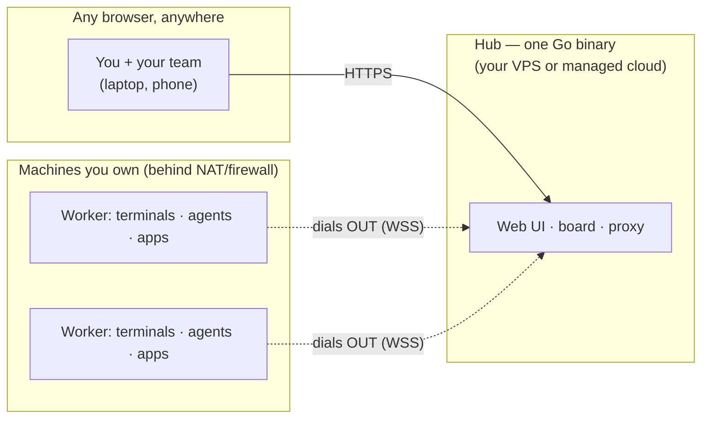

# Cordane

**Run your team's coding agents from anywhere — on machines you own.**

Cordane is a self-hostable control plane for AI coding agents (Claude Code and
friends) and the terminals, dev servers, and tickets around them. Workers run on
your hardware and dial **out** to the hub over a single outbound connection — so
you can reach a box behind corporate NAT or a home router from any browser, with
no inbound ports, no VPN, no SSH config.

🌐 **[cordane.ai](https://cordane.ai)** · 📖 **[Docs](https://cordane.ai/docs)** ·
🗺 **[Roadmap](https://cordane.ai/roadmap)** · 🔒 **[Security](SECURITY.md)**

**Free forever, self-hosted, every feature.** Two containers on a small VPS —
[jump to the quickstart](#self-hosting). Or let us run the hub for you: see
[pricing](https://cordane.ai/#pricing).



## What it does

**Persistent terminals, one browser tab away.** Real PTYs on your machines —
your login shell, your dotfiles, true color — that survive closing the laptop,
network drops, and hub restarts. Reattach from any browser, including your
phone (with a touch key bar for ctrl/esc/arrows). Two people can attach to the
same live terminal. If you live in tmux: sessions map to *spaces*, panes to
side-by-side terminals, and *space definitions* (saved layout + working dir +
command per pane) respawn your setup on demand — an alternative, not a drop-in
replacement (no tmux keybindings or copy-mode).

**A board that runs the work.** Drop a ticket on the kanban board and Cordane
cuts a git worktree, boots the dev server on its own port, and turns your
coding agent loose — while the whole team watches live. Review a diff and a
green-checks badge, then merge — from your phone if that's where you are.
Every run keeps its full audit trail: exact
prompt, exact diff, what checks ran. Keep your tracker — this is the execution
layer where agent work happens, not a project-management tool.

**Preview links without a tunnel.** Apps on a worker get a stable subdomain
(`myapp--worker.your-domain`) served through the worker's outbound connection —
no ngrok, no rotating hostnames, no per-seat paywall. Auth on by default;
flip an app to **Public** to share it with anyone, no account needed. Ticket
previews stay team-only. (For sharing previews — Cordane is not an inbound
tunnel for webhooks.)

**Teams on your terms.** GitHub sign-in with an admin-managed allowlist,
projects shared across a team, each member running work on their own private
worker. Self-host the hub on a $5 VPS, or use the managed cloud
(`your-team.cordane.app`) — workers stay on your hardware either way. Your
code, secrets, and compute never leave machines you control.

## How it's built

- **One Go binary, two roles**: `cordane server` (hub) and `cordane worker`.
- **Workers dial out** over WebSocket; the hub never connects in. Nothing to
  port-forward, nothing inbound to firewall.
- **SQLite** for all hub state — trivial backups (built-in Litestream
  replication to any S3-compatible bucket), no database server, easy export.
- Joining a machine is one command:

```sh
cordane worker join https://your-team.cordane.app --token crdjt_…
```

## Self-hosting

Two containers on one small VPS: the hub, plus Caddy for automatic TLS. Images
are public on GHCR, so you need nothing installed but Docker.

```sh
git clone https://github.com/cordane/cordane.git
cd cordane/deploy
cp .env.example .env         # fill in the values below, then:
docker compose up -d
```

Five values in `.env` get you running — your hub's URL, a secret key, and a
GitHub OAuth app's id/secret for sign-in:

| Var | What |
|-----|------|
| `EXTERNAL_URL` / `CONTROL_HOST` | your hub's URL / hostname |
| `CORDANE_SECRET_KEY` | `openssl rand -base64 32` — **back this up** |
| `CORDANE_GITHUB_CLIENT_ID/SECRET` | a GitHub OAuth app, callback `${EXTERNAL_URL}/api/v1/auth/github/callback` |

Open your `EXTERNAL_URL` and sign in with GitHub — **the first account to sign
in becomes the admin.** Then connect a machine:

```sh
curl -fsSL https://<your-hub>/install.sh | sh            # installs the `cordane` binary
cordane worker join https://<your-hub> --token crdjt_…   # token from the hub's Workers page
```

DNS records, wildcard preview subdomains, backups to any S3-compatible bucket,
and a "simple mode" that needs no DNS API token are all in
[`deploy/README.md`](deploy/README.md).

**No license key required.** The Community tier — 1 worker, 1 project, 2 users,
3 concurrent agent runs, and *every* feature — is free forever and never phones
home. Paid keys lift the caps and keep working offline within a grace window, so
a Cordane outage never blocks you. See
[pricing](https://cordane.ai/#pricing).

## Issues & feedback

This is Cordane's public home — bug reports and feature requests are welcome in
[Issues](../../issues). For anything security-related, see
[SECURITY.md](SECURITY.md).

## License

The contents of **this repository** — documentation and deployment
configuration — are MIT-licensed ([LICENSE](LICENSE)). Copy, fork and adapt them
freely.

The **container images** they deploy (`ghcr.io/cordane/cordane`,
`ghcr.io/cordane/caddy`) are proprietary software owned by Sitedity SRL, free to
run on the Community tier and otherwise governed by the
[Terms](https://cordane.ai/terms). [`NOTICE`](NOTICE) spells out the split.
